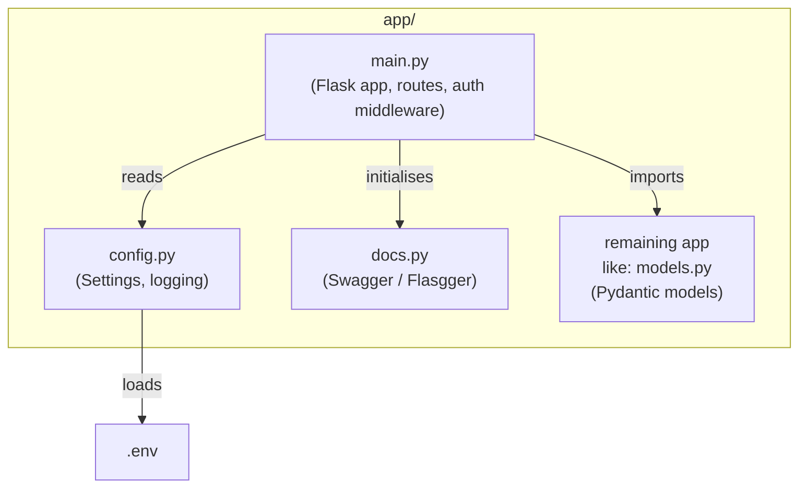
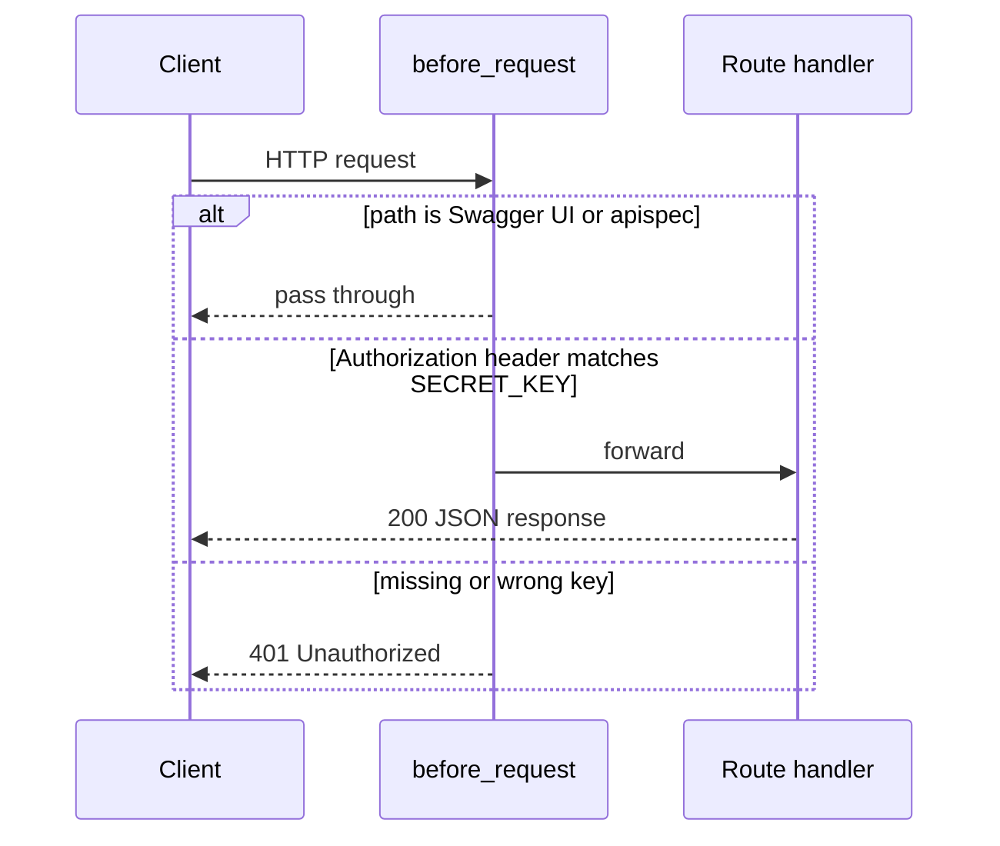
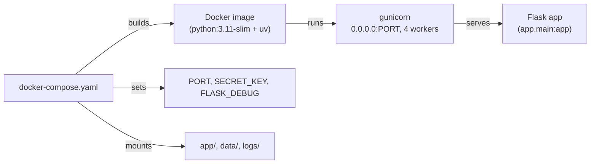

# Diagrams

## Application Architecture

```mermaid
graph TD
    subgraph app["app/"]
        main["main.py<br/>(Flask app, routes, auth middleware)"]
        config["config.py<br/>(Settings, logging)"]
        docs["docs.py<br/>(Swagger / Flasgger)"]
        app_content["remaining app<br>like: models.py<br/>(Pydantic models)"]
    end

    main -->|reads| config
    main -->|initialises| docs
    main -->|imports| app_content
    config -->|loads| env[".env"]
```

## Request Flow

```mermaid
sequenceDiagram
    participant C as Client
    participant M as before_request
    participant R as Route handler

    C->>M: HTTP request
    alt path is Swagger UI or apispec
        M-->>C: pass through
    else Authorization header matches SECRET_KEY
        M->>R: forward
        R-->>C: 200 JSON response
    else missing or wrong key
        M-->>C: 401 Unauthorized
    end
```

## Deployment

```mermaid
graph LR
    compose["docker-compose.yaml"]
    compose -->|builds| image["Docker image<br/>(python:3.11-slim + uv)"]
    compose -->|sets| env2["PORT, SECRET_KEY, FLASK_DEBUG"]
    compose -->|mounts| vols["app/, data/, logs/"]
    image -->|runs| gunicorn["gunicorn<br/>0.0.0.0:PORT, 4 workers"]
    gunicorn -->|serves| flask["Flask app<br/>(app.main:app)"]
```
